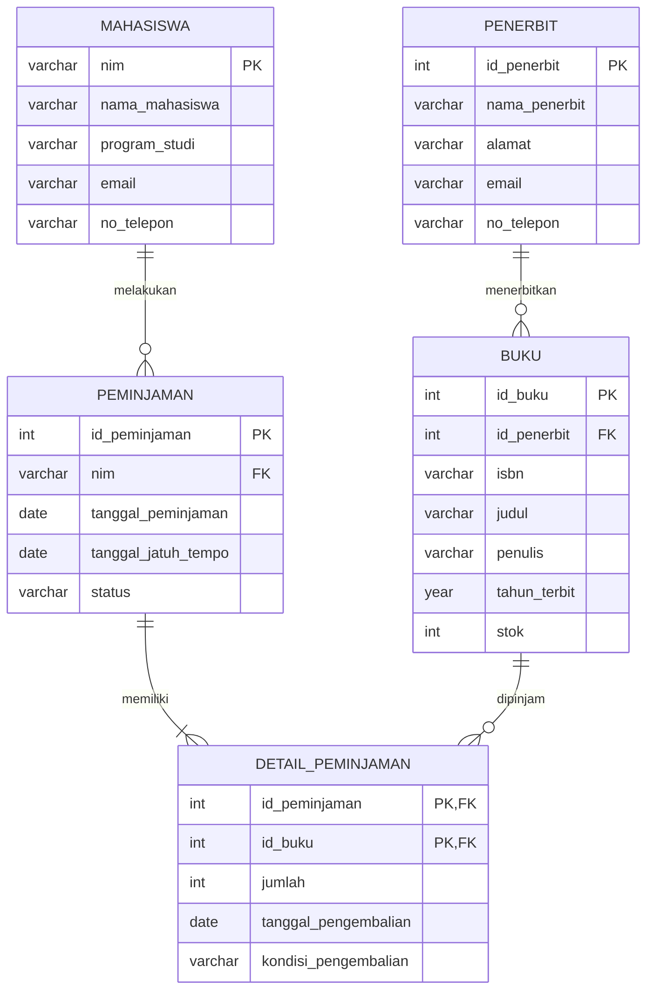

# Tugas Mandiri Modul 6

## Perancangan ERD E-Library Kampus

### 1. Identitas

| Data        | Keterangan                       |
| ----------- | -------------------------------- |
| Nama        | **[Nama Lengkap]**               |
| NIM         | **[NIM]**                        |
| Mata Kuliah | Pemodelan Database               |
| Tugas       | Perancangan ERD E-Library Kampus |

---

## 2. Deskripsi Sistem

E-Library Kampus merupakan sistem basis data yang digunakan untuk mengelola data perpustakaan dan proses peminjaman buku oleh mahasiswa.

Sistem menyimpan informasi mengenai mahasiswa, buku, penerbit, serta transaksi peminjaman dan pengembalian buku.

Dalam rancangan ini, satu mahasiswa dapat melakukan banyak transaksi peminjaman. Setiap transaksi peminjaman dapat memiliki satu atau beberapa buku melalui tabel detail peminjaman. Setiap buku diterbitkan oleh satu penerbit, sedangkan satu penerbit dapat menerbitkan banyak buku.

---

# 3. Identifikasi Entitas dan Atribut

Berdasarkan kebutuhan sistem, terdapat lima entitas/tabel utama:

1. **Mahasiswa**
2. **Penerbit**
3. **Buku**
4. **Peminjaman**
5. **Detail Peminjaman**

### 3.1 Entitas Mahasiswa

Menyimpan informasi mahasiswa yang dapat melakukan peminjaman buku.

| Atribut        | Keterangan              | Key |
| -------------- | ----------------------- | --- |
| nim            | Nomor induk mahasiswa   | PK  |
| nama_mahasiswa | Nama lengkap mahasiswa  | -   |
| program_studi  | Program studi mahasiswa | -   |
| email          | Email mahasiswa         | -   |
| no_telepon     | Nomor telepon mahasiswa | -   |

### 3.2 Entitas Penerbit

Menyimpan informasi penerbit buku.

| Atribut       | Keterangan              | Key |
| ------------- | ----------------------- | --- |
| id_penerbit   | Identitas unik penerbit | PK  |
| nama_penerbit | Nama penerbit           | -   |
| alamat        | Alamat penerbit         | -   |
| email         | Email penerbit          | -   |
| no_telepon    | Nomor telepon penerbit  | -   |

### 3.3 Entitas Buku

Menyimpan informasi buku yang tersedia di perpustakaan.

| Atribut      | Keterangan                | Key |
| ------------ | ------------------------- | --- |
| id_buku      | Identitas unik buku       | PK  |
| id_penerbit  | Identitas penerbit buku   | FK  |
| isbn         | Nomor ISBN buku           | -   |
| judul        | Judul buku                | -   |
| penulis      | Nama penulis buku         | -   |
| tahun_terbit | Tahun penerbitan buku     | -   |
| stok         | Jumlah buku yang tersedia | -   |

### 3.4 Entitas Peminjaman

Menyimpan informasi utama setiap transaksi peminjaman.

| Atribut             | Keterangan                          | Key |
| ------------------- | ----------------------------------- | --- |
| id_peminjaman       | Identitas unik transaksi            | PK  |
| nim                 | Mahasiswa yang melakukan peminjaman | FK  |
| tanggal_peminjaman  | Tanggal transaksi peminjaman        | -   |
| tanggal_jatuh_tempo | Batas waktu pengembalian            | -   |
| status              | Status transaksi                    | -   |

### 3.5 Entitas Detail Peminjaman

Menyimpan buku-buku yang terdapat dalam suatu transaksi peminjaman.

| Atribut              | Keterangan                     | Key    |
| -------------------- | ------------------------------ | ------ |
| id_peminjaman        | Identitas transaksi peminjaman | PK, FK |
| id_buku              | Identitas buku yang dipinjam   | PK, FK |
| jumlah               | Jumlah buku yang dipinjam      | -      |
| tanggal_pengembalian | Tanggal buku dikembalikan      | -      |
| kondisi_pengembalian | Kondisi buku saat dikembalikan | -      |

Primary Key pada tabel `detail_peminjaman` merupakan **composite key** yang terdiri dari `id_peminjaman` dan `id_buku`.

---

# 4. Simulasi Normalisasi

## 4.1 Unnormalized Form (UNF)

Pada bentuk tidak ternormalisasi, seluruh informasi peminjaman masih berada dalam satu struktur data dan terdapat kelompok data berulang.

Contoh:

| id_peminjaman | nim    | nama_mahasiswa | buku                | penerbit                      | tanggal_peminjaman | tanggal_jatuh_tempo | tanggal_pengembalian |
| ------------- | ------ | -------------- | ------------------- | ----------------------------- | ------------------ | ------------------- | -------------------- |
| PMJ001        | 130001 | Andi           | Database, Algoritma | Informatika Press, Tech Press | 2026-09-20         | 2026-09-27          | 2026-09-25, -        |

Pada contoh tersebut, atribut `buku`, `penerbit`, dan `tanggal_pengembalian` mengandung lebih dari satu nilai dalam satu atribut.

Hal tersebut menyebabkan adanya **repeating group** sehingga struktur belum memenuhi 1NF.

---

## 4.2 First Normal Form (1NF)

Untuk memenuhi 1NF, setiap atribut harus memiliki nilai atomik atau tidak dapat dibagi lagi.

Data kemudian dipecah menjadi satu baris untuk setiap buku yang dipinjam.

| id_peminjaman | nim    | nama_mahasiswa | id_buku | judul_buku | id_penerbit | nama_penerbit     | tanggal_peminjaman | tanggal_jatuh_tempo | tanggal_pengembalian |
| ------------- | ------ | -------------- | ------- | ---------- | ----------- | ----------------- | ------------------ | ------------------- | -------------------- |
| PMJ001        | 130001 | Andi           | BK001   | Database   | PB001       | Informatika Press | 2026-09-20         | 2026-09-27          | 2026-09-25           |
| PMJ001        | 130001 | Andi           | BK002   | Algoritma  | PB002       | Tech Press        | 2026-09-20         | 2026-09-27          | NULL                 |

Setiap sel sekarang hanya memiliki satu nilai.

Namun, masih terdapat ketergantungan parsial. Contohnya:

- `nama_mahasiswa` bergantung pada `nim`.
- `judul_buku` bergantung pada `id_buku`.
- `nama_penerbit` bergantung pada `id_penerbit`.
- Data transaksi bergantung pada `id_peminjaman`.

Karena itu, struktur ini belum memenuhi 2NF.

---

## 4.3 Second Normal Form (2NF)

Untuk mencapai 2NF, tabel harus sudah memenuhi 1NF dan tidak boleh terdapat **partial dependency**.

Data kemudian dipisahkan berdasarkan ketergantungan atributnya.

### Tabel Mahasiswa

| nim    | nama_mahasiswa | program_studi | email                                       | no_telepon  |
| ------ | -------------- | ------------- | ------------------------------------------- | ----------- |
| 130001 | Andi           | Informatika   | [andi@example.com](mailto:andi@example.com) | 08123456789 |

### Tabel Buku

| id_buku | id_penerbit | isbn          | judul     | penulis | tahun_terbit | stok |
| ------- | ----------- | ------------- | --------- | ------- | ------------ | ---- |
| BK001   | PB001       | 9781234567890 | Database  | Budi    | 2025         | 5    |
| BK002   | PB002       | 9780987654321 | Algoritma | Citra   | 2024         | 3    |

### Tabel Peminjaman

| id_peminjaman | nim    | tanggal_peminjaman | tanggal_jatuh_tempo | status |
| ------------- | ------ | ------------------ | ------------------- | ------ |
| PMJ001        | 130001 | 2026-09-20         | 2026-09-27          | Aktif  |

### Tabel Detail Peminjaman

| id_peminjaman | id_buku | jumlah | tanggal_pengembalian | kondisi_pengembalian |
| ------------- | ------- | -----: | -------------------- | -------------------- |
| PMJ001        | BK001   |      1 | 2026-09-25           | Baik                 |
| PMJ001        | BK002   |      1 | NULL                 | NULL                 |

Pada tahap ini, atribut pada tabel `detail_peminjaman` bergantung pada kombinasi `id_peminjaman` dan `id_buku`.

Namun, tabel `buku` masih menyimpan `id_penerbit` dan informasi penerbit belum dipisahkan. Untuk menghilangkan ketergantungan transitif, dilakukan normalisasi ke 3NF.

---

## 4.4 Third Normal Form (3NF)

Untuk mencapai 3NF, tabel harus sudah memenuhi 2NF dan tidak memiliki **transitive dependency**.

Pada tabel buku terdapat hubungan:

```text
id_buku → id_penerbit → nama_penerbit
```

Artinya, informasi mengenai penerbit tidak secara langsung bergantung pada `id_buku`, melainkan bergantung pada `id_penerbit`.

Oleh karena itu, informasi penerbit dipisahkan menjadi tabel `penerbit`.

### Tabel Penerbit

| id_penerbit | nama_penerbit     | alamat   | email                                                         | no_telepon |
| ----------- | ----------------- | -------- | ------------------------------------------------------------- | ---------- |
| PB001       | Informatika Press | Makassar | [info@informatikapress.com](mailto:info@informatikapress.com) | 0411123456 |
| PB002       | Tech Press        | Jakarta  | [info@techpress.com](mailto:info@techpress.com)               | 0211234567 |

### Tabel Buku Setelah 3NF

| id_buku | id_penerbit | isbn          | judul     | penulis | tahun_terbit | stok |
| ------- | ----------- | ------------- | --------- | ------- | -----------: | ---: |
| BK001   | PB001       | 9781234567890 | Database  | Budi    |         2025 |    5 |
| BK002   | PB002       | 9780987654321 | Algoritma | Citra   |         2024 |    3 |

Dengan demikian, rancangan akhir telah memenuhi prinsip 3NF karena setiap atribut non-key bergantung langsung pada primary key tabelnya dan tidak terdapat ketergantungan transitif.

---

# 5. ERD Logis

Berikut merupakan ERD logis sistem E-Library Kampus menggunakan Mermaid.



---

# 6. Rancangan Tabel Akhir

## 6.1 Tabel `mahasiswa`

| Nama Kolom     | Tipe Data    | Constraint  | Keterangan            |
| -------------- | ------------ | ----------- | --------------------- |
| nim            | VARCHAR(20)  | PRIMARY KEY | Nomor induk mahasiswa |
| nama_mahasiswa | VARCHAR(100) | NOT NULL    | Nama mahasiswa        |
| program_studi  | VARCHAR(100) | NOT NULL    | Program studi         |
| email          | VARCHAR(100) | UNIQUE      | Email mahasiswa       |
| no_telepon     | VARCHAR(20)  | -           | Nomor telepon         |

---

## 6.2 Tabel `penerbit`

| Nama Kolom    | Tipe Data    | Constraint                  | Keterangan      |
| ------------- | ------------ | --------------------------- | --------------- |
| id_penerbit   | INT          | PRIMARY KEY, AUTO_INCREMENT | ID penerbit     |
| nama_penerbit | VARCHAR(100) | NOT NULL                    | Nama penerbit   |
| alamat        | TEXT         | -                           | Alamat penerbit |
| email         | VARCHAR(100) | UNIQUE                      | Email penerbit  |
| no_telepon    | VARCHAR(20)  | -                           | Nomor telepon   |

---

## 6.3 Tabel `buku`

| Nama Kolom   | Tipe Data    | Constraint                  | Keterangan   |
| ------------ | ------------ | --------------------------- | ------------ |
| id_buku      | INT          | PRIMARY KEY, AUTO_INCREMENT | ID buku      |
| id_penerbit  | INT          | FOREIGN KEY, NOT NULL       | ID penerbit  |
| isbn         | VARCHAR(20)  | UNIQUE, NOT NULL            | ISBN buku    |
| judul        | VARCHAR(200) | NOT NULL                    | Judul buku   |
| penulis      | VARCHAR(150) | NOT NULL                    | Penulis buku |
| tahun_terbit | YEAR         | NOT NULL                    | Tahun terbit |
| stok         | INT          | NOT NULL, DEFAULT 0         | Jumlah stok  |

Foreign Key:

```text
buku.id_penerbit → penerbit.id_penerbit
```

---

## 6.4 Tabel `peminjaman`

| Nama Kolom          | Tipe Data   | Constraint                  | Keterangan         |
| ------------------- | ----------- | --------------------------- | ------------------ |
| id_peminjaman       | INT         | PRIMARY KEY, AUTO_INCREMENT | ID transaksi       |
| nim                 | VARCHAR(20) | FOREIGN KEY, NOT NULL       | Mahasiswa peminjam |
| tanggal_peminjaman  | DATE        | NOT NULL                    | Tanggal peminjaman |
| tanggal_jatuh_tempo | DATE        | NOT NULL                    | Batas pengembalian |
| status              | VARCHAR(20) | NOT NULL                    | Status transaksi   |

Foreign Key:

```text
peminjaman.nim → mahasiswa.nim
```

---

## 6.5 Tabel `detail_peminjaman`

| Nama Kolom           | Tipe Data   | Constraint               | Keterangan           |
| -------------------- | ----------- | ------------------------ | -------------------- |
| id_peminjaman        | INT         | PRIMARY KEY, FOREIGN KEY | ID transaksi         |
| id_buku              | INT         | PRIMARY KEY, FOREIGN KEY | ID buku              |
| jumlah               | INT         | NOT NULL                 | Jumlah buku          |
| tanggal_pengembalian | DATE        | NULL                     | Tanggal pengembalian |
| kondisi_pengembalian | VARCHAR(50) | NULL                     | Kondisi buku         |

Primary Key:

```text
(id_peminjaman, id_buku)
```

Foreign Key:

```text
detail_peminjaman.id_peminjaman → peminjaman.id_peminjaman
detail_peminjaman.id_buku → buku.id_buku
```

---

# 7. Relasi Antar Tabel

Relasi antar tabel pada sistem dapat dirangkum sebagai berikut:

```text
MAHASISWA
    │
    │ 1 : N
    ▼
PEMINJAMAN
    │
    │ 1 : N
    ▼
DETAIL_PEMINJAMAN
    ▲
    │ N : 1
    │
BUKU
    │
    │ N : 1
    ▼
PENERBIT
```

Penjelasan kardinalitas:

1. **Mahasiswa → Peminjaman**
   - Satu mahasiswa dapat memiliki banyak transaksi peminjaman.
   - Setiap transaksi peminjaman dilakukan oleh satu mahasiswa.
   - Relasi: **1 : N**

2. **Peminjaman → Detail Peminjaman**
   - Satu transaksi dapat memiliki satu atau lebih detail buku.
   - Setiap detail peminjaman hanya berasal dari satu transaksi.
   - Relasi: **1 : N**

3. **Buku → Detail Peminjaman**
   - Satu buku dapat muncul dalam banyak transaksi peminjaman.
   - Setiap detail peminjaman mengacu pada satu buku.
   - Relasi: **1 : N**

4. **Penerbit → Buku**
   - Satu penerbit dapat menerbitkan banyak buku.
   - Setiap buku memiliki satu penerbit.
   - Relasi: **1 : N**

---

# 8. Kesimpulan

Rancangan basis data E-Library Kampus terdiri dari lima tabel utama, yaitu `mahasiswa`, `penerbit`, `buku`, `peminjaman`, dan `detail_peminjaman`.

Proses normalisasi dilakukan secara bertahap mulai dari UNF, 1NF, 2NF, hingga 3NF. Pada tahap akhir, data yang memiliki ketergantungan parsial dan transitif telah dipisahkan ke dalam tabel yang sesuai.

Penggunaan tabel `detail_peminjaman` memungkinkan satu transaksi peminjaman memiliki beberapa buku sekaligus, sedangkan penggunaan Primary Key dan Foreign Key menjaga hubungan serta integritas data antar tabel.

Dengan rancangan tersebut, database dapat digunakan untuk menyimpan data mahasiswa, buku, penerbit, transaksi peminjaman, serta informasi pengembalian buku secara terstruktur dan mengurangi redundansi data
